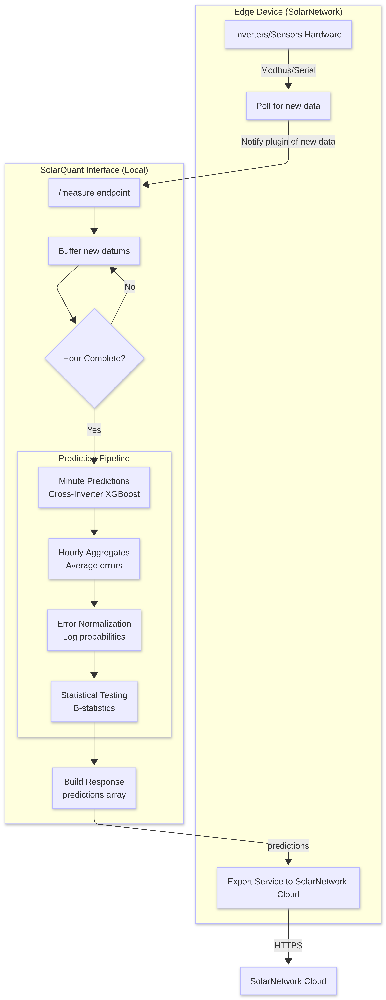
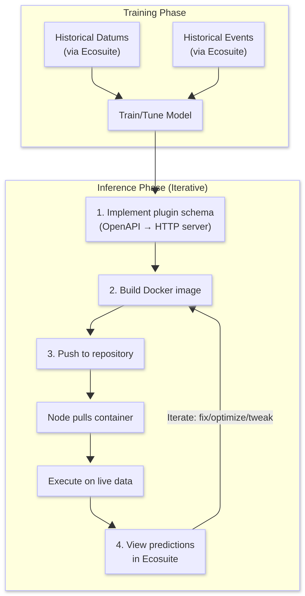

# SolarQuant Plugin Specification

This directory contains the specification for building SolarQuant ML plugins. Any model listed in the [Model Zoo](../README.md) implements this spec.

## How It Works

The `schema.yaml` file defines an OpenAPI 3.0 interface that your plugin must implement as an HTTP server. SolarQuant communicates with your plugin by sending measurement datums and receiving predictions in return.

### Steps to create a plugin

1. **Generate an HTTP server** from the provided `schema.yaml`. This can be in whatever language or framework you like.
2. **Create a Dockerfile** that builds and runs your HTTP server, bundling any dependencies needed for inference.
3. **Build the Docker image** and push it to a container registry.
4. **Configure the SolarNode** to pull your image. The node will automatically fetch new versions when you push updates.

## Architecture



SolarQuant plugins use a polling interface. When new datums are generated on the node, they are sent to your plugin via the `/measure` endpoint. Your plugin can store datums for later or use them immediately to make predictions.

If your plugin has predictions ready, it returns them in the `/measure` response. These predictions are then posted to SolarNetwork automatically.

## Endpoints

### `GET /health`

Called at regular intervals to verify your plugin is running. If a healthy response isn't received in time, the plugin is stopped and restarted.

**Response:**
```json
{
  "status": "healthy",
  "timestamp": 1672531200,
  "uptime": 86400,
  "details": {}
}
```

### `POST /measure`

Receives an array of new measurement datums:

```json
{
  "datums": [
    {
      "nodeId": 377,
      "sourceId": "/INV/1",
      "timestamp": 1672531200,
      "i": {
        "watts": 2450.5,
        "voltage": 240.2
      },
      "a": {
        "wattHours": 8234
      },
      "s": {
        "phase": "A"
      }
    }
  ]
}
```

Your service acknowledges the measurements and can include any predictions it has generated:

```json
{
  "accepted": 1,
  "rejected": 0,
  "predictions": [
    {
      "nodeId": 377,
      "sourceId": "/INV/1",
      "timestamp": 1672531200,
      "i": {
        "watts": 2435.2
      },
      "s": {
        "anomalyStatus": "NORMAL"
      },
      "meta": {
        "confidence": 0.95
      }
    }
  ],
  "message": "processed"
}
```

Each prediction follows the schema defined in `schema.yaml`. You can include any plugin-specific fields inside `meta`. If no predictions are ready, return an empty array or omit the field.

## Developer Workflow



1. Implement the SolarQuant plugin schema using the provided OpenAPI file.
2. Build your plugin into a Docker image.
3. Push your plugin to a container registry.
4. View results by looking at the uploaded predictions on SolarNetwork.

Steps 2-4 can be repeated to iterate on your model.

### Training

SolarQuant can download large streams of historical datums and events (such as device failures) via [Ecosuite](https://ecosuite.github.io/solarquant/). For example:

```bash
sqc datums stream -s /MA/**/INV/* -f timestamp,watts,current,voltage \
  --start 2022-05-01 --end 2022-06-01 -o datums.csv
```

### Inference

Your containerized plugin is deployed to a SolarNode at the edge. The node sends live measurements in the same format as historical data, and SolarQuant pushes your predictions to SolarNetwork for real-time viewing.

## Files

- **`schema.yaml`** -- OpenAPI 3.0 specification
- **`diagram.png`** -- Architecture diagram
- **`workflow.png`** -- Developer workflow diagram
